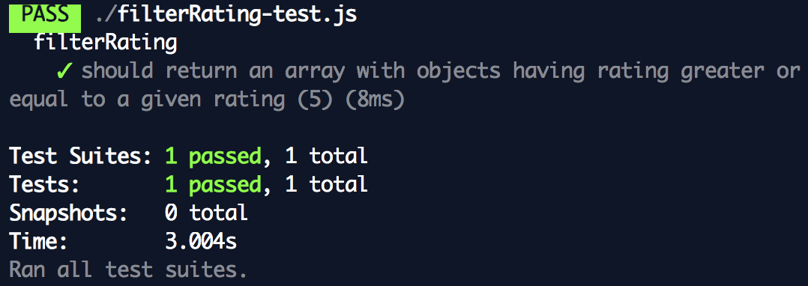
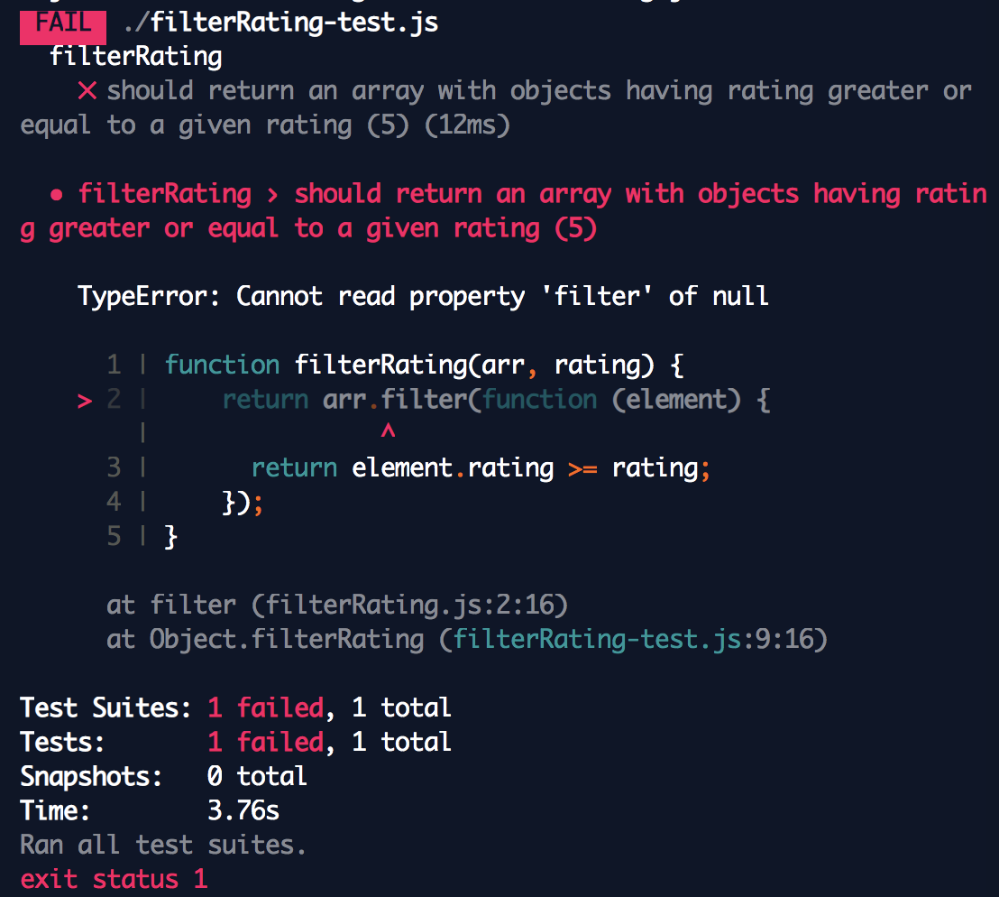
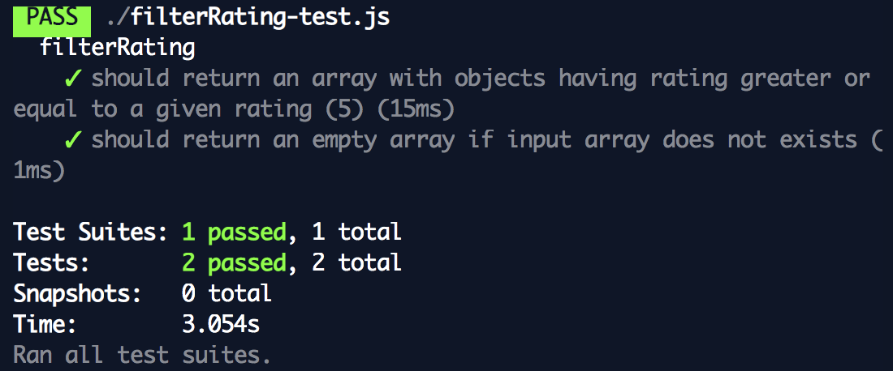
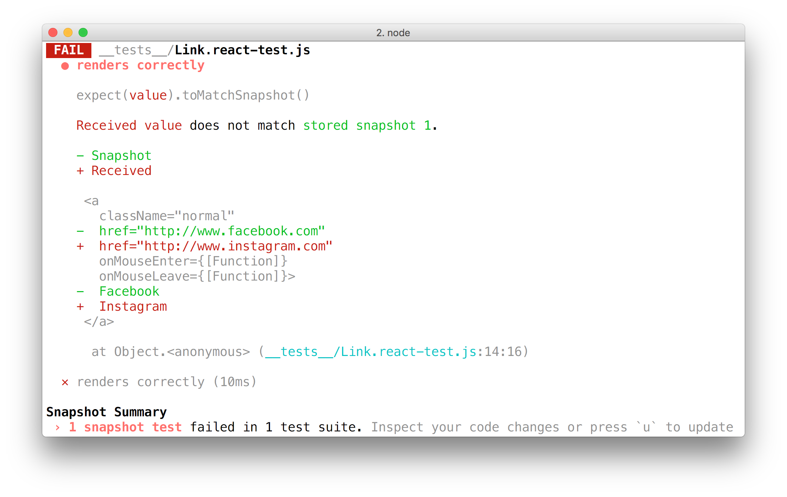

## JEST - Delightful JavaScript Testing
- [Jest](https://jestjs.io) là một thư viện testing do Facebook Open Source.
- Nó được tạo ra với mục tiêu trong tâm là sự đơn giản, ban đầu là cho ReactJS, nhưng nó đã vượt xa những nhu cầu ban đầu, để trở thành một thư viện testing cho javascript một cách hoàn chỉnh. Hiện tại, Jest đang hỗ trợ Babel, TypeScript, Node, React, Angular, Vue ...
- Một trong nhưng ưu điểm lớn của jest là nó làm việc hiệu quả với rất ít các bước setup và configuration. Nó đến với các tính năng chính là assertion library và hỗ trợ mocking. Bạn không cần tốn công để đọc tài liệu setup/configuration mà chỉ cần chú ý tới việc viết unit tests và chạy. 
- Được thiết kế cho BDD giống như hầu hết các thư viện testing hiện nay. Jest còn có một tính năng đặc biệt, đó là snapshot testing, nó lưu lại snapshot (hay nói cách khác là cấu trúc view tại thời điểm hiện tại) rồi so sánh với snapshot trong tương lai, nếu chúng không giống nhau thì test của chúng ta đã fail hoặc có một số thứ đã thay đổi. 

## Getting started

Nếu bạn đang muốn test một project ReactJS/React Native thì xin chúc mừng, Jest đã được tự động setup và bạn chỉ việc dùng thôi. Còn nếu bạn muốn sử dụng Jest cho các framework/library khác thì làm theo các bước sau:

1. Cài đặt từ NPM (chú ý rằng bạn cần cài đặt Node trong máy trước)

```
npm i jest --save-dev
```

hoặc `yarn`

```
yarn add dev jest
```

2. Mở file `package.json` và sửa script `test` sang dùng Jest:

```
"scripts": {
    "test": "jest"
},
```

Vậy là xong, giờ bạn có thể bắt đầu viết test bằng Jest rồi 🎉🎉🎉

## Unit testing với Jest

Trong bất cứ dự án nào cũng vậy, chúng ta đều có **specification** (spec). Ở bài viết này thì giả sử chúng ta vừa nhận được một spec khá đơn giản từ khách hàng, đó là **một hàm Javascript có thể filter một array của object**. Với mỗi object chúng ta cần check một property tên là `rating`, nếu `rating` có giá trị lớn hơn hoặc bằng giá trị được truyền vào thì chúng ta sẽ đưa object đó vào mảng kết quả và trả về.

Đây là đoạn code thực hiện spec đó sau khi nhóm phát triển đã thảo luận:

```javascript
function filterRating(arr, rating) {
    return arr.filter(function (element) {
        return element.rating >= rating;
    });
}
module.exports = filterRating;
```

Để bắt đầu test được hàm này thì đầu tiên chúng ta phải phân tích những case có thể xảy ra. Nó bao gồm:

+ Nếu có object có rating lớn hơn rating nhận vào, nó sẽ tồn tại trong mảng trả về.
+ Nếu có object có rating bằng rating nhận vào, nó sẽ tồn tại trong mảng trả về.
+ Nếu có object có rating thấp hơn rating nhận vào, nó sẽ không tồn tại trong mảng trả về.

Nhìn có vẻ đủ rồi đấy nhỉ, giờ thì bắt đầu test thôi:

Đầu tiên, tạo 1 file `filterRating.test.js` trong folder `test` và require hàm chúng ta đã tạo, sau đó tạo 1 test block:

```javascript
const filterRating = require('path-to-file');

describe('filterRating', () => {
  // chúng ta sẽ thực hiện test trong đây
});
```

Hàm đầu tiên chúng ta cần biết là `describe`, một hàm trong Jest dùng để chứa 1 hoặc nhiều những test liên quan. Ở đây chúng ta sẽ thực hiện các test liên quan đến hàm `filterRating` nên chúng ta sẽ có 1 block `describe` như vậy (hoặc thực ra bạn thích đặt tên gì cũng được, miễn là nó thể hiện các test trong này liên quan đến nó).

Tiếp theo chúng ta sẽ có thêm 1 hàm `test`, hàm này chính là test block mà chúng ta sẽ implement:

```javascript
const filterRating = require('path-to-file');

describe('filterRating', () => {
    it('should return an array with objects having rating greater or equal to a given rating (5)', () => {
        // thực hiện test
    });
});
```

Lúc này thì chúng ta đã sẵn sàng để có thể viết test rồi. Hãy nhớ rằng testing chỉ là là vấn đề của **input là gì**, **function nào** và **output mong đợi là gì** thôi. Đầu tiên chúng ta sẽ định nghĩa một input đơn giản là một mảng object:

```javascript
const filterRating = require('path-to-file');

describe('filterRating', () => {
    it('should return an array with objects having rating greater or equal to a given rating (5)', () => {
        const inputArray = [{ name: "Joker", rating: 6 }, { name: "Avengers", rating: 5 }, { name: "Joker", rating: 4 },];
    });
});
```

Sau đó chúng ta sẽ định nghĩa **output mong đợi** sau khi chạy hàm `filterRating` là gì. Theo như spec thì nó sẽ là mảng chứa các object có rating lớn hơn rating nhận vào (trong case này là 5):

```javascript
const filterRating = require('path-to-file');

describe('filterRating', () => {
    it('should return an array with objects having rating greater or equal to a given rating (5)', () => {
        const inputArray = [{ name: "Joker", rating: 6 }, { name: "Avengers", rating: 5 }, { name: "Joker", rating: 4 },];

        const outputArray = [{ name: "Joker", rating: 6 }, { name: "Avengers", rating: 5 }];
    });
});
```

Giờ thì chúng ta đã đủ điều kiện để viết test cho hàm này rồi. Chúng ta sẽ sử dụng `expect` và một `matcher` để check xem kết quả nhận được có đúng với output mà chúng ta mong đợi hay không:

```javascript
const filterRating = require('path-to-file');

describe('filterRating', () => {
    it('should return an array with objects having rating greater or equal to a given rating (5)', () => {
        const inputArray = [{ name: "Joker", rating: 6 }, { name: "Avengers", rating: 5 }, { name: "Joker", rating: 4 },];

        const outputArray = [{ name: "Joker", rating: 6 }, { name: "Avengers", rating: 5 }];

        expect(filterRating(inputArray, 5)).toEqual(outputArray);
    });
});
```

Giờ thì chúng ta có thể chạy test này để xem nó có pass không nhé:

```
npm test
```



Tuyệt vời, hàm của chúng ta đã chạy đúng như chúng ta nghĩ 🎉🎉🎉

Vậy là xong. Chúng ta đem code này release cho khách hàng và hoàn toàn yên tâm vì đã có test cho nó rồi, lo làm gì? 

1 tuần sau đang hóng feedback và khen ngợi từ khách hàng thì bị PM chửi thẳng mặt: code chạy bị crash! Khách hàng bị tổn thất nặng nề còn user thì rút gần hết rồi! Và bạn ngệt mặt ra vì rõ ràng đã test các case định nghĩa ra rồi mà. Sau khi xem log thì bạn tái mặt vì đã không test 2 trường hợp khá quan trọng: mảng nhận vào hoặc object nằm trong mảng là `undefined/null`!

Quả thật, khi thêm 2 case này vào test suite thì test chạy sẽ bị fail:

```javascript
const inputArray = null;
```

```javascript
const inputArray = [null];
```



Biết nguyên nhân rồi thì giờ sửa 2 case này thôi:

```javascript
function filterRating(arr, rating) {
    if (!arr) return [];
    return arr.filter(function (element) {
      return element && element.rating >= rating;
    });
}
```

Đầu tiên chúng ta check xem mảng truyền vào có tồn tại hay không, nếu không tồn tại thì trả về mảng rỗng. Trong hàm filter, chúng ta cũng check kết hợp của object tồn tại và có rating lớn hơn rating nhận vào.

Sau đó chúng ta cần update test để thêm 2 case chúng ta vừa implement:

```javascript
const filterRating = require('./filterRating');

describe('filterRating', () => {
    it('should return an array with objects having rating greater or equal to a given rating (5)', () => {
        const inputArray = [{ name: "Joker", rating: 6 }, { name: "Avengers", rating: 5 }, { name: "Joker", rating: 4 }, null]; //thêm null vào mảng

        const outputArray = [{ name: "Joker", rating: 6 }, { name: "Avengers", rating: 5 }];

        expect(filterRating(inputArray, 5)).toEqual(outputArray);
    });
    it('should return an empty array if input array does not exists', () => {
        const inputArray = null;

        const outputArray = [];

        expect(filterRating(inputArray, 5)).toEqual(outputArray);
    });
});
```



Trên đây chỉ là 1 case rất cơ bản trong unit test, bài học rút ra là chúng ta cần đánh giá đầy đủ ảnh hưởng của code và những trường hợp có thể xảy ra để có thể viết test được hiệu quả. 


## Using Jest with React

Trong React, Jest là test runner mặc định. Vì cùng là thư viện được open source bởi Facebook, Jest có một số chức năng hỗ trợ đặt biệt cho React mà một số test runner khác không có được, và một trong số đó là **snapshot testing**.

Snapshot test là một kỹ thuật dùng để test UI Component trong React, nó hữu dụng trong trường hợp bạn muốn chắc chắn là UI không thay đổi một cách khó lường. Một ví dụ điển hình cho snapshot test đó là khi app render một component, chúng ta có thể "chụp" lại snapshot của component đó và sau đó so sánh với snapshot mà chúng ta đã lưu trước đó. Test sẽ fail nếu 2 snapshot không giống nhau, lúc đó chỉ có 2 trường hợp: 1 là thay đổi không lường trước, 2 là snapshot tham khảo đã không được update cho phiên bản mới của component.

Với React component, thay vì render ra UI thật (yêu cầu cần phải build cả app), bạn có thể sử dụng test renderer để tạo ra một serializable value của React tree. Cùng xem một ví dụ về test cho `Link` component:

```javascript
import React from 'react';
import Link from '../Link.react';
import renderer from 'react-test-renderer';

it('renders correctly', () => {
  const tree = renderer
    .create(<Link page="http://www.facebook.com">Facebook</Link>)
    .toJSON();
  expect(tree).toMatchSnapshot();
});
```

Khi test được chạy lần đầu, Jest sẽ tạo ra một file snapshot nhìn như sau:

```javascript
exports[`renders correctly 1`] = `
<a
  className="normal"
  href="http://www.facebook.com"
  onMouseEnter={[Function]}
  onMouseLeave={[Function]}
>
  Facebook
</a>
`;
```

File snapshot này cần được commit cùng với code thay đổi, và cần được review trong quá trình merge. Trong những lần chạy tiếp theo, Jest sẽ so sánh output được render với snapshot trước đó. Nếu chúng giống nhau thì test sẽ được pass. Nếu chúng không giống nhau thì có thể là do test runner đã tìm thấy bug trong code của bạn (với trường hợp này thì là `Link` component) và bạn cần fix bug đó, hoặc code của `Link` đã thay đổi mà bạn lại chưa update cho file snapshot.

### Update snapshot

Một trong những nguyên nhân khiến 2 snapshot không giống nhau có thể là do chúng ta đã thay đổi url của `Link` component trong test case:

```javascript
it('renders correctly', () => {
  const tree = renderer
    .create(<Link page="http://www.instagram.com">Instagram</Link>)
    .toJSON();
  expect(tree).toMatchSnapshot();
});
```



Bởi vì chúng ta đã thay đổi component để hiển thị một địa chỉ khác, chúng ta cũng cần phải update snapshot cho component này. Bạn có thể chạy Jest với một flag để tạo lại snapshot:

```
jest --updateSnapshot
```

Nếu bạn chạy lại test sau đó, nó sẽ pass vì lúc này snapshot đã được update.

### DOM Testing

Nếu bạn muốn assert hoặc điều khiển component sau khi render thì bạn có thể sử dụng `react-testing-library` hoặc `Enzyme`. 

**react-testing-library**

Để sử dụng thư viện này, bạn cần cài đặt nó:

```
yarn add --dev @testing-library/react
```

Dưới đây là implementation của một checkbox, nó sẽ thay đổi giữa 2 label dựa vào trạng thái hiện tại:

```javascript
// CheckboxWithLabel.js

import React from 'react';

export default class CheckboxWithLabel extends React.Component {
  constructor(props) {
    super(props);
    this.state = {isChecked: false};

    // bind manually because React class components don't auto-bind
    // http://facebook.github.io/react/blog/2015/01/27/react-v0.13.0-beta-1.html#autobinding
    this.onChange = this.onChange.bind(this);
  }

  onChange() {
    this.setState({isChecked: !this.state.isChecked});
  }

  render() {
    return (
      <label>
        <input
          type="checkbox"
          checked={this.state.isChecked}
          onChange={this.onChange}
        />
        {this.state.isChecked ? this.props.labelOn : this.props.labelOff}
      </label>
    );
  }
}
```

```javascript
// __tests__/CheckboxWithLabel-test.js
import React from 'react';
import {cleanup, fireEvent, render} from '@testing-library/react';
import CheckboxWithLabel from '../CheckboxWithLabel';

// automatically unmount and cleanup DOM after the test is finished.
afterEach(cleanup);

it('CheckboxWithLabel changes the text after click', () => {
  const {queryByLabelText, getByLabelText} = render(
    <CheckboxWithLabel labelOn="On" labelOff="Off" />,
  );

  expect(queryByLabelText(/off/i)).toBeTruthy();

  fireEvent.click(getByLabelText(/off/i));

  expect(queryByLabelText(/on/i)).toBeTruthy();
});
```

Bạn có thể đọc thêm về `react-testing-library` tại [đây](https://github.com/testing-library/react-testing-library).

**Enzyme**

Cài đặt:

```
yarn add --dev enzyme
```

Nếu bạn dùng React version dưới 15.5.0, bạn cần cài thêm:

```
yarn add --dev react-addons-test-utils
```

Với test trên, chúng ta có thể viết lại nó bằng `Enzyme` và sử dụng [shallow renderer](http://airbnb.io/enzyme/docs/api/shallow.html) như ví dụ sau:

```javascript
// __tests__/CheckboxWithLabel-test.js

import React from 'react';
import {shallow} from 'enzyme';
import CheckboxWithLabel from '../CheckboxWithLabel';

test('CheckboxWithLabel changes the text after click', () => {
  // Render a checkbox with label in the document
  const checkbox = shallow(<CheckboxWithLabel labelOn="On" labelOff="Off" />);

  expect(checkbox.text()).toEqual('Off');

  checkbox.find('input').simulate('change');

  expect(checkbox.text()).toEqual('On');
});
```

Bạn có thể đọc thêm về `Enzyme` tại [đây](https://airbnb.io/enzyme/).


## Writing tests for Redux

